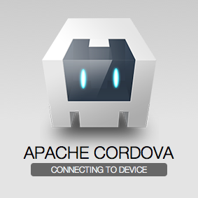
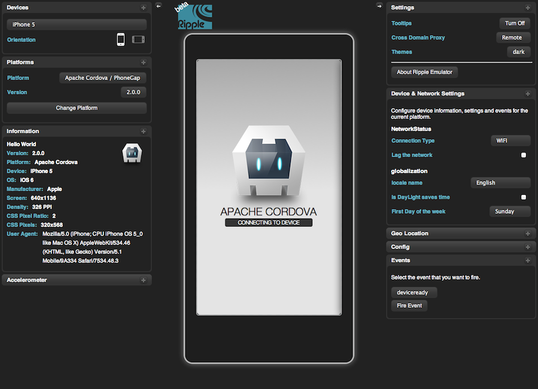
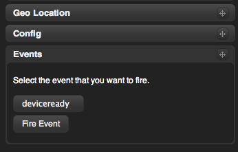
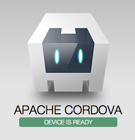
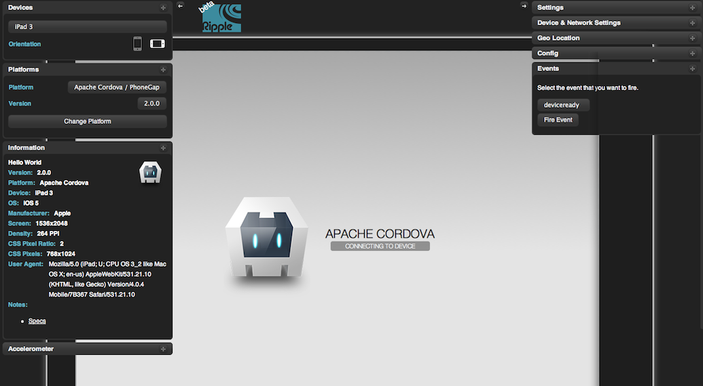

# The Cordova Command-line Interface

This guide shows you how to create applications and deploy them to
various native mobile platforms using the `cordova` command-line
interface (CLI). This tool allows you to create new projects, build
them on different platforms, and run them within an emulator. You can
also use the CLI to initially generate project code, after which you
use various platforms' IDEs to develop them further.

## Prerequisites

Before running any command-line tools, you need to install SDKs for
each platform you wish to target. See Installing Platform SDKs for
more details.

To add support or rebuild a project for any platform, you need to run
the command-line interface from the same machine that supports the
platform's SDK. The CLI supports the following combinations:

* iOS             (Mac)
* Android         (Mac, Linux)
* Blackberry      (Mac, Windows)
* Windows Phone 7 (Windows)
* Windows Phone 8 (Windows)

The more likely it is that you run the CLI from different machines,
the more it makes sense to maintain a remote source code repository,
whose assets you pull down to local working directories.

To install the `cordova` command-line tool, follow these steps:

1. Download and install [Node.js](http://nodejs.org/). Following
   installation, you should be able to run `node` or `npm` on your
   command line.

1. Install the `cordova` utility. The `sudo` command may be necessary
   to install development utilities in otherwise restricted directories:

        $ sudo npm install -g cordova

   The installation log may produce errors for any uninstalled
   platform SDKs.  Following installation, you should be able to run
   `cordova` on the command line.

1. To ensure permissions are correct, run this command, changing
   _LOGIN_ to match your account name:

        $ sudo chown -R LOGIN /usr/local/lib/node_modules/cordova

After installing the `cordova` utility, you can always update it to
the latest version by running the following command:

        $ sudo npm update -g cordova

Use this syntax to install a specific version:

        $ sudo npm install -g cordova@2.7.0

Run the `info` command for a listing of available version numbers:

        $ npm info cordova

## Create an App

Go to the directory where you maintain your source code, and run a
command such as the following:

        $ cordova create HelloWorld com.example.hello "Hello World"

The first argument specifies a _HelloWorld_ directory that is
generated for your project. Its `www` subdirectory houses your
application's home page, along with various resources under `css`,
`js`, and `img` that are common for web development. The `config.xml`
file contains important metadata needed to distribute the application.

The other two arguments are optional: the `com.example.hello` argument
provides your project with a reverse-domain-style identifier, and the
`"Hello World!"` provides the application's display text. You can edit
both of these values later in the `config.xml` file.

## Add Platforms

All subsequent commands need to be run within the project's directory,
or any subdirectories within its scope:

        $ cd HelloWorld

Before you can build the project, you need to specify a set of target
platforms. Your ability to run these commands depends on whether your
machine supports each SDK, and whether you have installed each SDK.
Run any of these from a Mac:

        $ cordova platform add ios
        $ cordova platform add android
        $ cordova platform add blackberry

Run any of these from a Windows machine, where _wp_ refers to
different versions of the Windows Phone operating system:

        $ cordova platform add wp7
        $ cordova platform add wp8
        $ cordova platform add android
        $ cordova platform add blackberry

Run this to check your current set of platforms:

        $ cordova platforms ls

(Note the `platform` and `platforms` commands are synonymous.)

Run the following to remove a platform:

        $ cordova platform remove blackberry

When you run commands to add or remove platforms, it's reflected in
the contents of the project's _platforms_ directory, where each
platform you specify appears as a subdirectory. The _www_ source
directory is reproduced within each platform's subdirectory, appearing
for example in _platforms/ios/www_ or _platforms/android/assets/www_.
By default, each platform's configuration file is set up to be able to
access all of Cordova's APIs.

If you wish, you can use an SDK at this point to open the project you
created. However, any edits you make to the project in an SDK affect
the derivative set of assets, not the original cross-platform source
files. Use this approach if you simply want to initialize a project.
(See the Platform Development Guide for information on how to develop
applications within each SDK.)  Read on if you wish to use
command-line tools for the entire development cycle.

## Build the App

By default, the `cordova create` script generates a skeletal web-based
application whose home page is the project's `www/index.html` file.
Edit this application however you want, but any initialization should
be specified as part of the `deviceready` event handler, referenced by
default from `www/js/index.js`. (See API and Configuration Guide for
details.)

Run the following command to iteratively build the project:

        $ cordova build

This generates platform-specific code within the project's `platforms`
subdirectory.  You can optionally limit the scope of each build to
specific platforms:

        $ cordova build ios

The `cordova build` command is a shorthand for the following, which in
this example is also targeted to a single platform:

        $ cordova prepare ios
        $ cordova compile ios

In this case, once you run `prepare`, you can use Apple's Xcode SDK as
an alternative to modify and compile the platform-specific code that
Cordova generates within `platforms/ios`. You can use the same
approach with other platforms' IDEs.

## View the App in a Browser

Since the application uses web-based components, you can often use a
standard web browser to preview them directly from the source _www_
directory.  For example, run this command to preview the application:

        $ cordova serve ios

By default, the application is available at `http://localhost:8000/`,
which you can modify with your own optional port number:

        $ cordova serve ios 2013

Either way, you can view the application within a browser window:

The size of the browser window doesn't correspond to how it would
appear on the device.  Also, the __Connecting to device__ message
lacks any context, since there is no mobile device to connect to.
Unlike `serve`, running the alternate `ripple` command displays the
application within the device's larger context:

        $ cordova ripple ios

The _ripple_ emulator provides an outer skin that demonstrates how the
application works with device-level features. For example, you can
simulate changes in location, changes to orientation, and other
accelerometer-driven shaking gestures. Other platform features, such
as access to the camera or user contacts, can _only_ be tested on the
device.

As a basic example, the default application features a handler for the
custom `deviceready` event, which ordinarily fires once Cordova
establishes contact with device-level APIs.  You must fire the event
manually within the ripple emulator:

As part of its initialization phase, The application displays a new
log message:

Specifying a platform, such as `ios` or `android`, makes the
application run under `serve` or `ripple` with device-specific user
agent strings. In addition, `ripple` applies the screen size for
specific devices. After running `ripple`, you also have the option to
view the application as various other devices, under the __Devices__
tab at the top left.  For example, here is how an application would
appear on an iPad that's tipped to its side:

The `serve` command is only appropriate for web applications that
_don't_ interact with Cordova APIs, which are detailed in the API
Reference.  The `ripple` command is appropriate if your application
responds to location, orientation, and varying network conditions.
Neither approach is reliable for applications that take photos, record
audio or video, or access users' contact data. They also don't work
for hybrid applications that mix cordova WebViews with native
components, or that use plug-ins. (See Extended Hybrid Applications
for details.)

<!--

## View the App in an Emulator

"emulate"

        plugin(s) [add|remove|ls [path]] ..... adds or removes a
                plugin (from the specified path), or lists all
                currently-added plugins

-->
