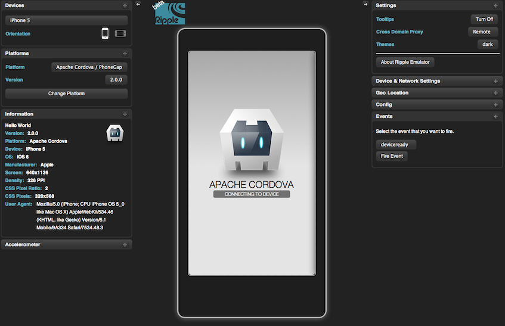
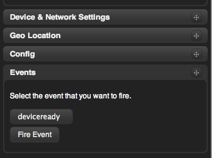
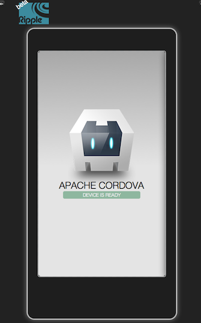

# Cordova Command Primer

This guide shows you how to create applications and deploy them to
various native mobile platforms using the `cordova` command-line
utility. This tool allows you to create new projects, build them on
different platforms, and run them within an emulator. You can also use
this tool to initially generate project code and use various
platforms' IDEs to develop them further.

## Prerequisites

The Cordova command-line utility is available Mac OSX and Linux.

* Download and install [Node.js](http://nodejs.org/). Following
  installation, you should be able to run `node` or `npm` on your
  command line.

* Download and install SDKs for the mobile platforms you wish to support:

  * [iOS](http://developer.apple.com/):

  * [BlackBerry](http://developer.blackberry.com/cascades/downloads/).
    The SDK places a workspace in your home directory by default, but
    you can configure it to prompt for and remember a different
    directory.

  * [Android](http://developer.android.com/)

  The Android SDK's `tools` and `platform-tools` directories need to
  be included in the system PATH. Here are ways you would typically
  modify different shell environments in your `.bashrc` or `.cshrc`
  congiguration files:

        PATH=$PATH:$HOME/bin:/path/to/sdk/tools:/path/to/sdk/platform-tools         # bash
        set PATH = ($PATH $HOME/bin /path/to/sdk/tools /path/to/sdk/platform-tools) # csh

* Install the `cordova` utility. The `sudo` command may be necessary
  to install in otherwise restricted directories:

        $ sudo npm install -g cordova

  Following installation, you should be able to run `cordova` on the
  command line. The installation log may produce errors for any
  uninstalled platform SDKs. To ensure permissions are correct, follow
  up with the following command, changing _LOGIN_ to match your
  account name:

        $ sudo chown -R LOGIN /usr/local/lib/node_modules/cordova

## Create an App

Go to the directory where you want to maintain your source code, and
run the following command:

        $ cordova create HelloWorld com.example.hello "Hello World"

The first argument specifies the `HelloWorld` directory created for
your project. Its `www` subdirectory houses your application's home
page, along with various resources under `css`, `js`, and `img` that
are common for web development. The `config.xml` file contains
information needed to distribute the application.

The other two arguments are optional: the `com.example.hello` argument
provides a reverse-domain-style identifier, and the `"Hello World!"`
provides display text. You can edit both of these values later in the
`config.xml` file.

## Add Platforms

All subsequent commands need to be run within the project's directory:

        $ cd HelloWorld

Before you can build the project, you need to specify a set of target
platforms.  Run any of the following at any point during development:

        $ cordova platform add android
        $ cordova platform add ios
        $ cordova platform add blackberry

Run this to check your current set of platforms:

        $ cordova platform ls

Run the following to remove a platform:

        $ cordova platform remove blackberry

<!-- s/b error if already removed -->

## Build the App

By default, the `cordova create` script generates a skeletal web-based
application whose home page is the project's `www/index.html` file.
Edit this application however you want, but any initialization should
be specified as part of the `deviceready` event handler, referenced by
default from `www/js/index.js`. (See API Primer for details.)

Run the following command to iteratively build the project:

        $ cordova build

This generates platform-specific code within the project's `platforms`
subdirectory.  You can optionally limit the scope of each build to
specific platforms:

        $ cordova build ios

The `cordova build` command is a shorthand for the following, which in
this example is also targeted to a single platform:

        $ cordova prepare ios
        $ cordova compile ios

In this case, once you run `prepare`, you can use Apple's Xcode SDK as
an alternative to modify and compile the platform-specific code that
Cordova generates within `platforms/ios`. You can use the same
approach with other platforms' IDEs, which may help to quickly set up
a variety of configuration settings that allow access to device and
network APIs.

<!-- Q: This implies forking the iOS project from others. Are there
scenarios where you'd keep running `prepare`, then use Xcode to tweak
the results in some way without editing source?  -->

## View the App

Since the application uses web-based components, you can use a
standard web browser to preview different platforms' instances for
your project. For example, run this command to preview the iOS
application:

        $ cordova serve ios

By default, the application is available at `http://localhost:8000/`,
which you can modify with your own optional port number:

        $ cordova serve ios 2013

Unlike `serve`, running the alternate `ripple` command displays the
application within the device's larger context:

        $ cordova ripple ios

The _ripple_ emulator provides an outer skin that demonstrates how the
application works with device-level features. For example, you can
simulate changes in location, changes to orientation, and other
accelerometer-driven shaking gestures. (Other platform features, such
as access to the camera or user contacts, can only be tested on the
device.)

As a basic example, the default application features a handler for the
custom `deviceready` event, which ordinarily fires once Cordova
establishes contact with device-level APIs.  You must fire the event
manually within the ripple emulator:

As part of its initialization phase, The application displays a new
log message:

<!--

        plugin(s) [add|remove|ls [path]] ..... adds or removes a
                plugin (from the specified path), or lists all
                currently-added plugins

-->
